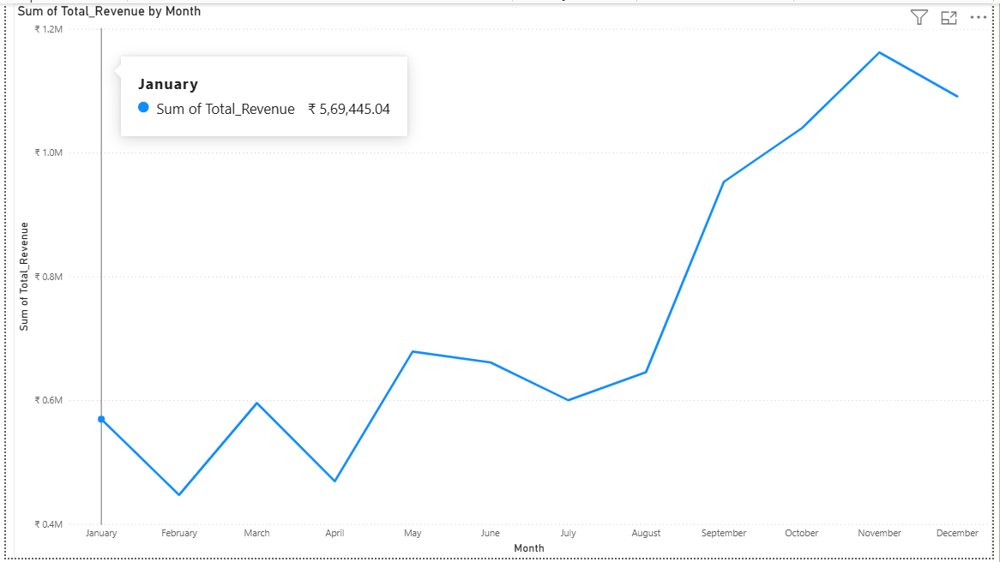
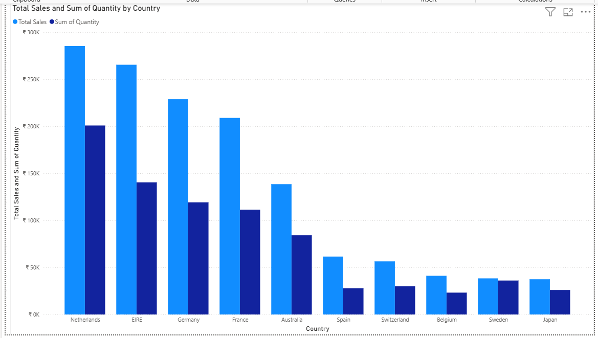
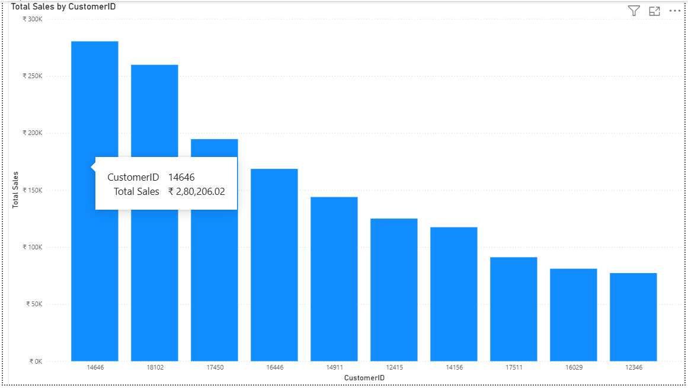
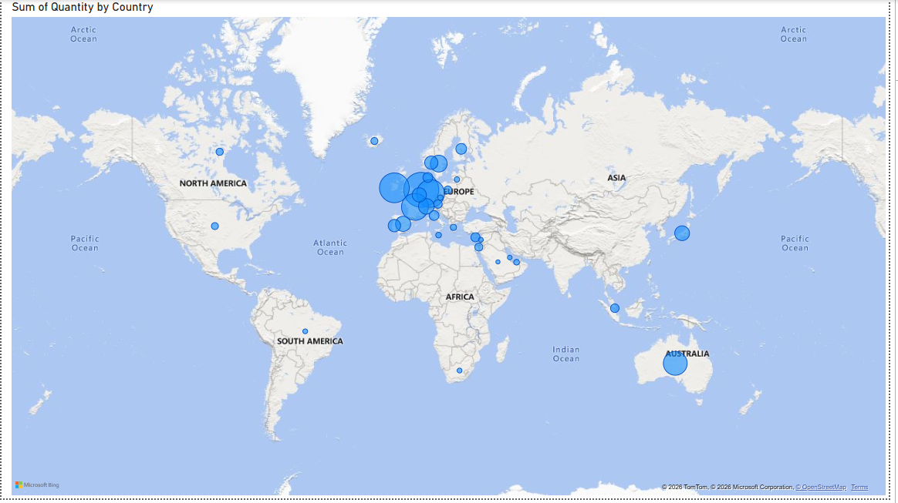

# 📊 Tata Group — Data Visualisation Job Simulation
> Completed via [Forage](https://www.theforage.com/) | April 2026

---

## 📌 Overview

This repository contains my work from the **Tata Group Data Visualisation Job Simulation**
hosted on Forage. The simulation replicates real tasks performed by analysts at Tata
Consultancy Services (TCS) — involving business question framing, data visualisation
theory, hands-on dashboard building in Power BI, and executive-level insight communication.

The dataset used is an **Online Retail dataset** containing transactional records across
multiple countries, with fields including Invoice details, Product descriptions, Quantity,
Unit Price, Customer ID, and Country.

---

## 🏢 About the Simulation

**Company:** Tata Group (Tata Consultancy Services)
**Track:** Data Visualisation & Business Intelligence
**Platform:** Forage
**Completed:** April 2026

---

## 🎯 Tasks Completed

---

✅ Task 1 — Framing the Business Scenario
Drafted 8 strategic business questions — 4 for the CEO and 4 for the CMO —
before touching any data. Questions covered areas like revenue trends, market
expansion, pricing strategy, customer retention, and marketing budget allocation.

💡 Key skill: Thinking like a business stakeholder, not just a data analyst.

✅ Task 2 — Choosing the Right Visuals
Completed a theory-based quiz on data visualisation best practices —
matching 8 business scenarios to the correct chart type (line, bar, map, scatter, etc.)
Result: All 8 correct 

💡 Key skill: Knowing which visual to use and why — wrong charts mislead decisions.

✅ Task 3 — Creating Effective Visuals in Power BI
The core hands-on task. Cleaned the raw dataset in Power Query Editor
(removed returns, pricing errors, fixed date formats), created a calculated
Revenue column (Quantity × Unit Price), then built 4 executive-ready visuals:
| Visual                                                     | Type                  | For |
|-----------------------------------------------------------|-----------------------|-----|
| Monthly Revenue Trend — 2011                               | Line Chart            | CEO |
| Top 10 Countries by Revenue & Quantity (Excl. UK)          | Clustered Bar Chart   | CMO |
| Top 10 Customers by Revenue (Descending)                   | Clustered Bar Chart   | CMO |
| Global Product Demand by Country (Excl. UK)                | Filled Map            | CEO |

✅ Task 4 — Communicating Insights to Leadership
Presented findings in an executive-appropriate format — leading with business
conclusions, avoiding technical jargon, and linking each visual back to the original
question it answered.

💡 Key skill: Translating data into clear, actionable business language.

---

## 📸 Screenshots

> Add your screenshots here after saving them from Power BI

### Visual 1 — Monthly Revenue Trend (2011)

### Visual 2 — Top 10 Countries by Revenue & Quantity

### Visual 3 — Top 10 Customers by Revenue

### Visual 4 — Global Demand Map

---

## 🔍 Key Business Insights from the Data

1. **November is the peak revenue month** — retail operations should plan maximum
   stock, staffing, and marketing budget around Q4, particularly October–November.

2. **Netherlands, EIRE, and Germany** are the strongest international markets
   outside the UK — ideal candidates for the next phase of expansion investment.

3. **Top customer concentration is a risk** — the business relies heavily on a
   small group of high-revenue customers. A structured retention and loyalty strategy
   is needed to protect this revenue.

4. **Large parts of Asia, Africa, and South America show near-zero demand**
   — these are genuine greenfield expansion opportunities for the CEO's growth strategy.

5. **High quantity and high revenue markets correlate** — suggesting that volume-driven
   pricing (competitive low prices, high sales) is working better than premium pricing
   in international markets.

---

## 🛠️ Tools & Skills Used

| Tool / Skill | Usage |
|---|---|
| **Power BI Desktop** | Dashboard creation, data modelling |
| **Power Query Editor** | Data cleaning, filtering, type conversion |
| **DAX (Data Analysis Expressions)** | Calculated column for Revenue |
| **Data Visualisation Theory** | Choosing correct chart types |
| **Business Analysis** | Framing executive questions, insight communication |
| **Storytelling with Data** | Presenting findings to non-technical leadership |

---

## 🙋 What I Gained from This Simulation

- Learned how to **think like a business analyst** — framing questions before
  touching any data
- Gained hands-on experience with **Power BI** — from raw data to executive dashboard
- Understood the importance of **data cleaning** before analysis — dirty data
  produces misleading insights
- Practiced **communicating data insights** to non-technical stakeholders in a
  clear, decision-focused way
- Understood how different **chart types serve different business purposes** —
  choosing the wrong visual can mislead decision-makers
---

## 🏅 Certificate

**Issued by:** Tata Group via Forage — April 2026
🔗 [View verified certificate on LinkedIn](#) ← *add your link here*

